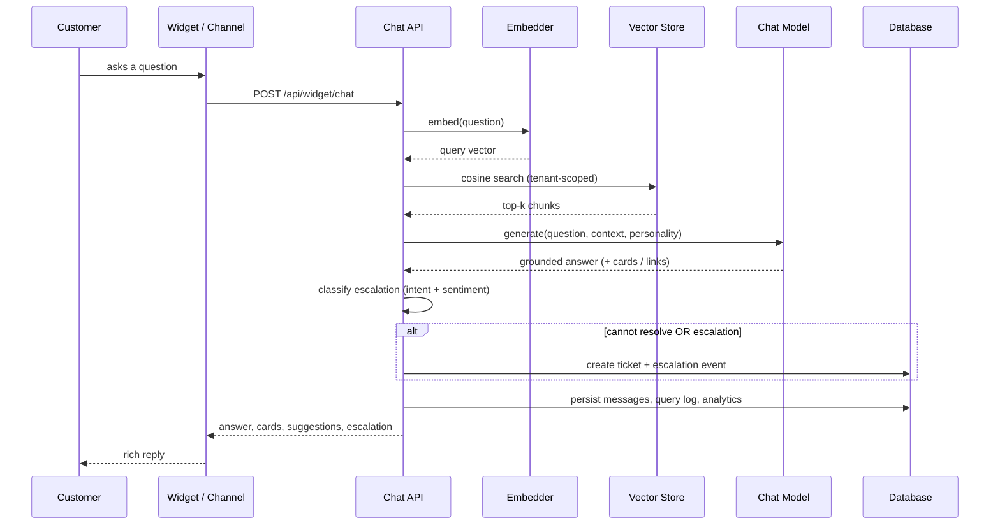

# Helpdesk AI

A multi-tenant SaaS platform that lets any business build, train, and deploy an
AI customer-support assistant on its **own knowledge base**. The assistant
answers customer questions with grounded, retrieval-augmented responses, creates
support tickets when it can't resolve an issue, escalates the ones that matter,
and ships with a modern embeddable chat widget and a full analytics deck.

Built for the Magentic AI assessment.

> **Runs with zero external dependencies.** With no API keys set, the platform
> runs in a fully-offline **demo mode**: a deterministic local embedder powers
> retrieval and a grounded mock model writes answers from your documents. Add
> `ANTHROPIC_API_KEY` (and optionally `OPENAI_API_KEY`) and it upgrades to real
> Claude generation and semantic embeddings with no code changes.

---

## ✨ Highlights

- **Business admin portal** — auth (login / register / forgot-password), RBAC
  (Owner / Agent), and a live dashboard.
- **Knowledge base management** — drag-and-drop upload of **PDF / DOCX / TXT /
  Markdown**; each file is parsed → chunked → embedded → stored as vectors;
  view, delete, and re-index.
- **Retrieval-augmented AI** — pluggable embedder + vector store + chat model
  behind clean interfaces; answers are grounded strictly in retrieved context.
- **Configurable assistant** — bot name, welcome message, personality
  (Professional / Friendly / Technical), accent color, suggested questions, and
  escalation rules, with a **live widget preview** that talks to your real KB.
- **Rich chat widget** — text, bullet lists, **tables**, **rich cards**, links,
  and suggested-question chips; embeddable on any site with one `<script>` tag.
- **Ticketing + intelligent escalation** — refunds, payment failures, outages,
  legal and angry customers are auto-flagged with the right priority; a kanban
  board and a priority-laned escalation dashboard.
- **Conversation history** — searchable transcripts with a full event timeline
  and **human handoff** (an agent can join any live conversation).
- **Analytics** — resolution rate, response time, escalation rate, most
  referenced documents, failed queries, and unanswered questions.
- **Multi-tenant** — every business has isolated documents, chatbot, tickets and
  analytics, scoped by a public key.
- **Multi-channel** — widget, inbound **WhatsApp**, and **email-to-ticket**
  webhooks all funnel through one chat engine.

---

## 🧱 Tech stack

| Layer        | Choice                                                              |
| ------------ | ------------------------------------------------------------------ |
| Frontend     | Next.js 15 (App Router) · React 19 · TypeScript · Tailwind CSS v4  |
| Motion / UI  | Framer Motion · hand-built SVG charts · Lucide icons               |
| Backend      | Next.js Route Handlers (REST) · layered service architecture       |
| Auth         | JWT (jose) in httpOnly cookies · bcrypt · RBAC                     |
| Database     | Prisma ORM · SQLite (dev) / PostgreSQL (prod) — provider-portable  |
| Vector store | Application-layer cosine similarity (pgvector / Qdrant adapter doc) |
| AI           | Claude (Anthropic) when keyed · grounded offline mock otherwise    |
| Embeddings   | OpenAI `text-embedding-3-small` when keyed · local hashed embedder |

---

## 🚀 Getting started (local)

Prerequisites: **Node 18+** (tested on Node 22).

```bash
# 1. Install
npm install

# 2. Create the database + seed the demo tenant
npm run setup          # prisma generate + db push + seed

# 3. Run
npm run dev            # http://localhost:3000
```

That's it — no Docker, no Postgres, no API keys required.

### 🔑 Demo admin credentials

| Role  | Email                | Password       |
| ----- | -------------------- | -------------- |
| Owner | `admin@aurora.demo`  | `Password123!` |
| Agent | `agent@aurora.demo`  | `Password123!` |

The seed creates a demo business, **Aurora Outdoors**, with five knowledge-base
articles (in [`sample-knowledge-base/`](./sample-knowledge-base)) and ~70
conversations, tickets and analytics events so every screen is populated.

Public widget key: `pk_demo_aurora_outdoors_public`
Live widget preview: `/widget?key=pk_demo_aurora_outdoors_public`

---

## 🤖 Enabling real Claude + embeddings (optional)

Copy `.env.example` to `.env` and set:

```bash
ANTHROPIC_API_KEY="sk-ant-..."     # answers generated by Claude
ANTHROPIC_MODEL="claude-opus-4-8"  # any current Claude model id
OPENAI_API_KEY="sk-..."            # real semantic embeddings (recommended)
```

The active providers are shown in **Settings → AI engine** and at
`GET /api/health`. After switching embedding providers, click **Re-index all**
on the Knowledge Base page (or `POST /api/documents/reindex`) to recompute
vectors.

---

## 🧠 How the AI works (RAG)



Ingestion pipeline: **parse → chunk (paragraph-aware, overlapping) → embed →
store vectors**. Retrieval and generation are isolated behind the `Embedder`,
`VectorStore`, and `ChatModel` interfaces in [`src/lib/ai`](./src/lib/ai), so
providers swap without touching the application.

See [`docs/ARCHITECTURE.md`](./docs/ARCHITECTURE.md) for the full system diagram,
data model, and the production scaling path (pgvector / Qdrant).

---

## 🗂️ Project structure

```
src/
  app/
    (admin)/        Authenticated portal: dashboard, knowledge-base,
                    configuration, conversations, tickets, escalations,
                    analytics, settings (route group with auth guard)
    api/            REST route handlers (auth, documents, config, chat,
                    tickets, conversations, analytics, widget, integrations)
    login | register | forgot-password | reset-password
    widget/         Full-page widget (iframe target of /widget.js)
    page.tsx        Marketing landing page with a live chat demo
  components/
    landing/        Hero, features, pipeline, embed, showcase, footer
    admin/          App shell (sidebar, command palette), page primitives
    chat/           Reusable ChatPanel, markdown + rich-content renderers
    widget/         Floating embeddable chat widget
    ui/             Buttons, inputs, badges, toasts, charts
  lib/
    ai/             embedder, vectorstore, chatmodel, rag, ingest, escalation
    services/       chat (single chat-turn engine), metrics
    auth.ts, api.ts, db.ts, validation.ts, constants.ts ...
prisma/
  schema.prisma     Multi-tenant data model
  seed.ts           Demo tenant + sample KB + realistic data
public/
  widget.js         Embeddable loader script
  widget-demo.html  Example of the widget embedded on a third-party site
sample-knowledge-base/   Five Markdown KB articles
```

---

## 🔌 Embedding the widget on any site

```html
<script
  src="https://YOUR_APP_URL/widget.js"
  data-key="pk_demo_aurora_outdoors_public"
  defer
></script>
```

The loader injects an isolated iframe (host CSS can't leak in), sized to the
launcher when closed and expanded when the panel opens. Open
[`public/widget-demo.html`](./public/widget-demo.html) for a working example, or
copy the snippet from **Settings → Embed your widget**.

---

## 🧪 REST API (selected)

| Method | Route                               | Purpose                          |
| ------ | ----------------------------------- | -------------------------------- |
| POST   | `/api/auth/register \| login`       | Create tenant / sign in          |
| GET    | `/api/dashboard`                    | Headline metrics                 |
| GET    | `/api/analytics`                    | Chat + knowledge-base analytics  |
| POST   | `/api/documents` (multipart)        | Upload + ingest documents        |
| POST   | `/api/documents/[id]/reindex`       | Re-embed a document              |
| GET/PUT| `/api/config`                       | Read / update bot configuration  |
| POST   | `/api/chat`                         | Authenticated "test your bot"    |
| POST   | `/api/widget/chat`                  | Public widget chat (publicKey)   |
| GET/PATCH | `/api/tickets[/:id]`             | List / update tickets            |
| GET    | `/api/conversations[/:id]`          | Transcripts + events             |
| POST   | `/api/conversations/[id]/handoff`   | Human handoff                    |
| POST   | `/api/integrations/whatsapp`        | Inbound WhatsApp → AI            |
| POST   | `/api/integrations/email`           | Inbound email → ticket           |
| GET    | `/api/health`                       | Status + active AI providers     |

All authenticated routes enforce session + tenant scoping; mutating config /
team / reindex routes are **Owner-only** (RBAC).

---

## ☁️ Deployment

The app is a standard Next.js server. Two supported paths:

### Option A — Render / Railway / Fly (SQLite + persistent disk)

A `Dockerfile` and `render.yaml` are included. On Render: **New → Blueprint →
point at this repo**. The blueprint provisions a web service with a 1 GB disk
mounted at `/data`, sets `DATABASE_URL=file:/data/prod.db`, runs migrations,
seeds the demo on first boot, and starts the server. Set
`NEXT_PUBLIC_APP_URL` to the assigned URL after the first deploy.

### Option B — Vercel + managed Postgres (Neon / Supabase)

1. In `prisma/schema.prisma` set `provider = "postgresql"`.
2. Set `DATABASE_URL` to your Postgres connection string and `AUTH_SECRET`.
3. Build command: `prisma generate && prisma db push && next build`.
4. Run the seed once: `npm run db:seed`.

The data model is provider-portable (no SQLite-only types); vector search is in
the application layer, so it works on either database unchanged.

---

## 📊 Evaluation criteria mapping

| Criteria          | Where it lives                                                            |
| ----------------- | ------------------------------------------------------------------------ |
| Code Quality 20%  | Typed end-to-end, layered services, Zod validation, single chat engine   |
| Architecture 20%  | Pluggable AI interfaces, multi-tenant, RBAC, `docs/ARCHITECTURE.md`      |
| AI Implementation 20% | Full RAG: parse/chunk/embed/retrieve/ground/generate + escalation     |
| UI/UX 15%         | Bespoke dark "command-deck" design system, motion, live previews         |
| Scalability 15%   | Tenant isolation, provider-swappable embeddings/LLM/vector store         |
| Deployment 10%    | Dockerfile, render.yaml, Vercel path, offline demo mode                  |

---

## 📦 Scripts

```bash
npm run dev        # dev server
npm run build      # production build (prisma generate + next build)
npm run setup      # generate client + push schema + seed
npm run db:seed    # seed demo data
npm run db:reset   # wipe + re-seed
npm run db:studio  # Prisma Studio
```
