<div align="center">

# Helpdesk AI

### Build, train & deploy an AI customer-support agent on your **own** knowledge base.

Grounded answers from your docs · auto-ticketing · intelligent escalation · an embeddable widget · a full analytics deck — in one multi-tenant platform.

<br/>

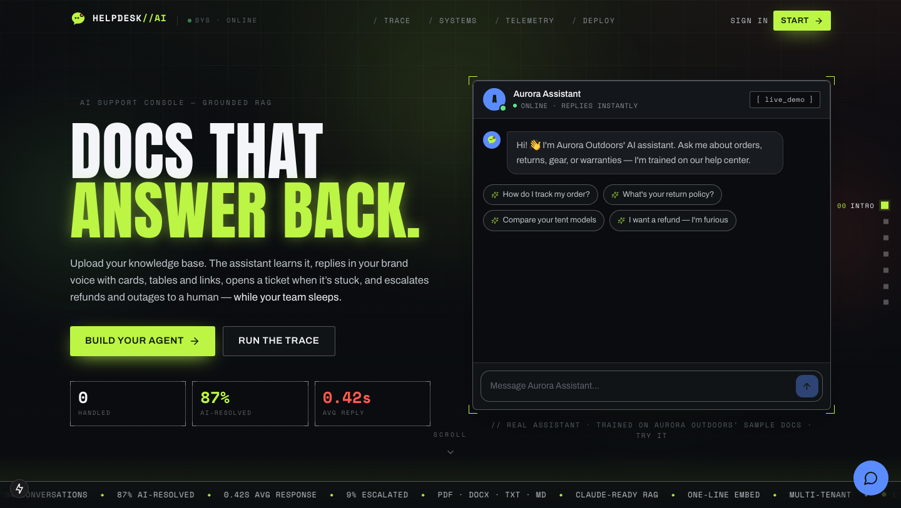

</div>

---

## What is this?

**Helpdesk AI** is a multi-tenant SaaS platform. Any business signs up, uploads its
help docs (PDF / DOCX / TXT / Markdown), and gets a support assistant that:

- answers customer questions with **retrieval-augmented generation** — grounded
  *strictly* in that business's documents, never invented;
- renders rich replies — **tables, cards, links, bullet steps**, not just text;
- opens a **ticket** the moment it can't resolve something;
- reads intent + sentiment to **escalate** refunds, outages and angry customers
  to a human with the right priority;
- ships as a one-line **embeddable widget**, plus WhatsApp & email-to-ticket;
- reports everything back on a live **analytics** deck.

> ### 🟢 Runs with zero setup
> With **no API keys**, the platform runs in a fully-offline **demo mode**: a
> deterministic local embedder powers retrieval and a grounded mock model writes
> answers from your documents. Add a **free [Groq](https://console.groq.com/keys)
> key** and it upgrades to real LLM generation — no code changes. (Anthropic /
> Claude is supported as an alternative; OpenAI is optional for semantic
> embeddings.)

---

## A look inside

A bespoke **"OPERATOR"** design system — a brutalist mission-control console:
acid-lime *signal* + hot-coral *escalation* on near-black, condensed poster type,
HUD framing, and a scroll-reactive landing that narrates how the AI works.

<table>
  <tr>
    <td width="50%">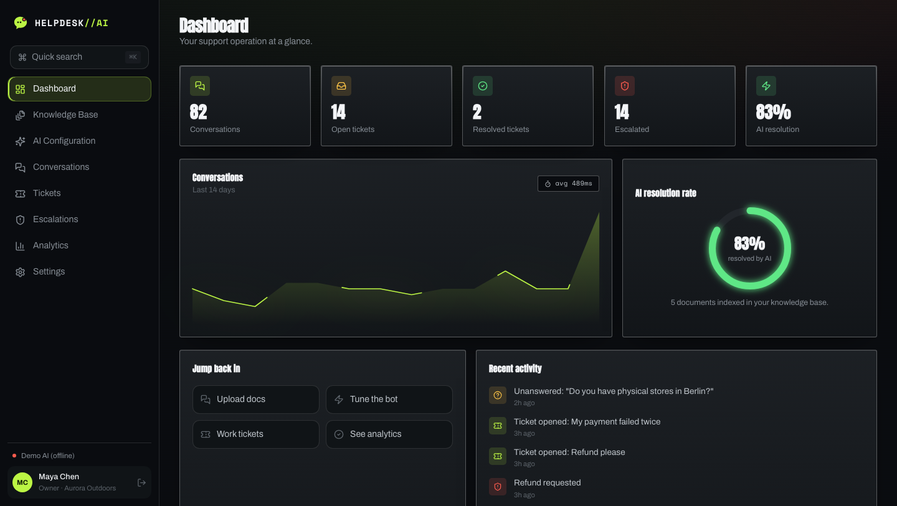<br/><sub><b>Dashboard</b> — headline metrics, live volume chart, AI-resolution gauge</sub></td>
    <td width="50%">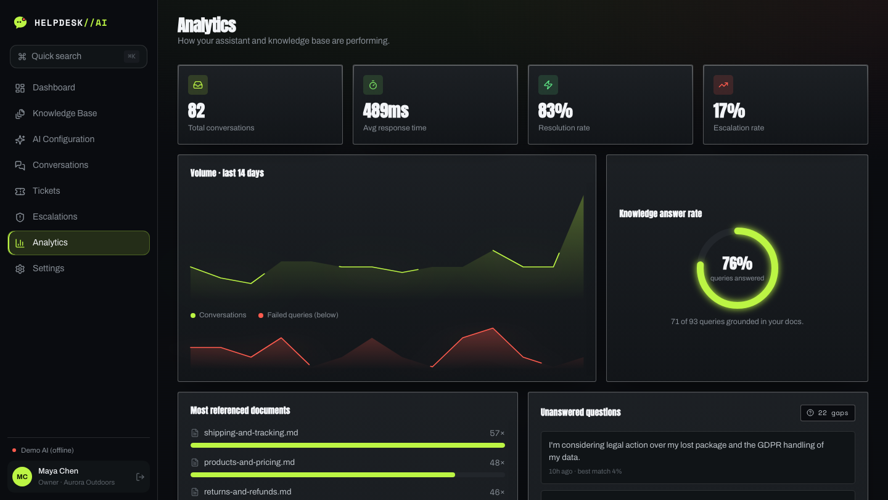<br/><sub><b>Analytics</b> — resolution rate, response time, top docs, unanswered queries</sub></td>
  </tr>
  <tr>
    <td>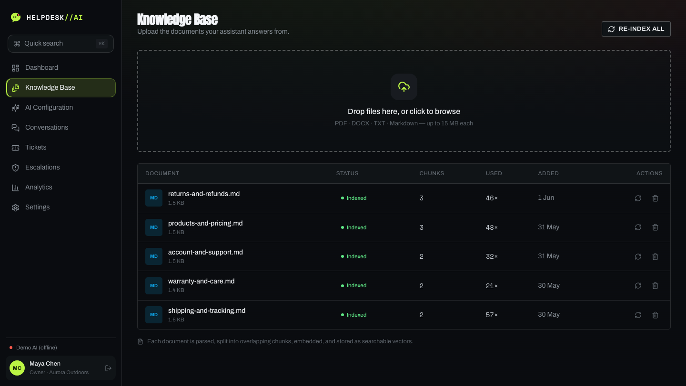<br/><sub><b>Knowledge base</b> — upload → parse → chunk → embed → index</sub></td>
    <td>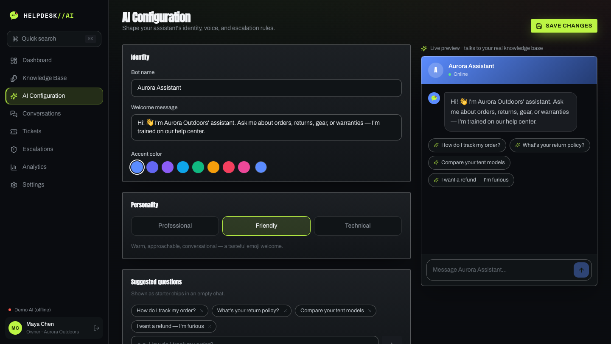<br/><sub><b>Configuration</b> — bot voice, suggestions, escalation rules + live preview</sub></td>
  </tr>
  <tr>
    <td>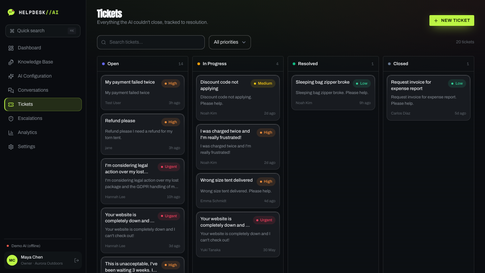<br/><sub><b>Tickets</b> — kanban board, priority-tagged, auto-created by the AI</sub></td>
    <td>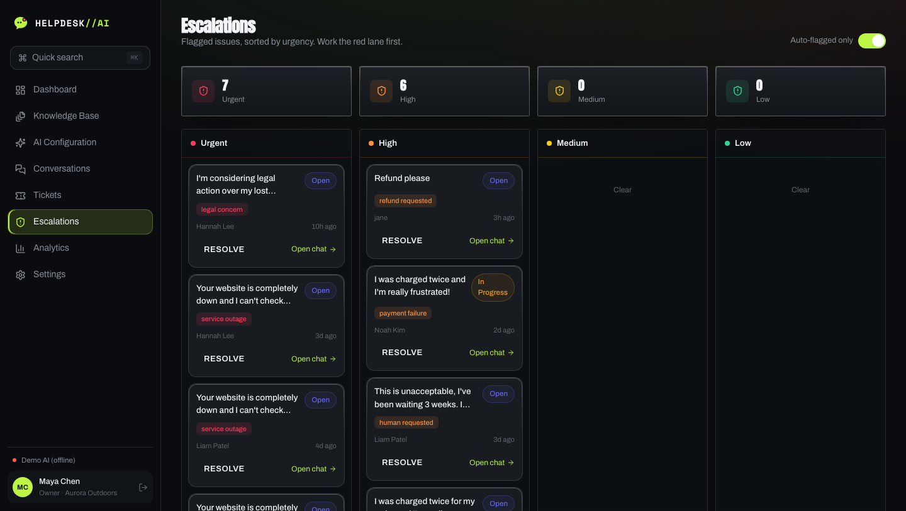<br/><sub><b>Escalations</b> — priority-laned queue for the cases that matter</sub></td>
  </tr>
  <tr>
    <td>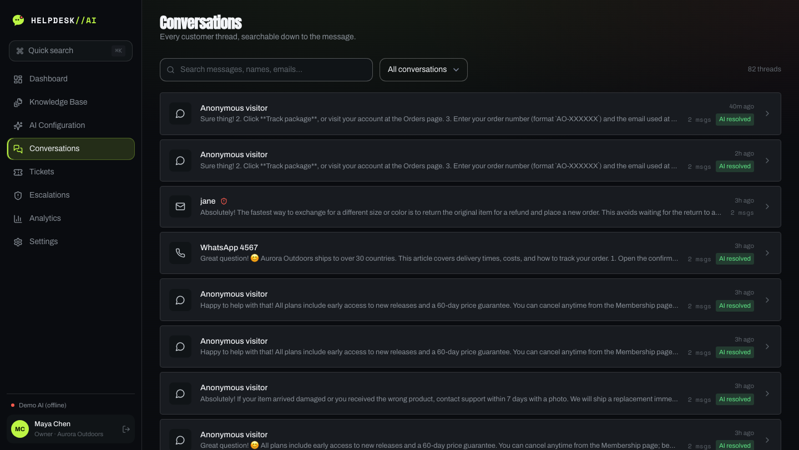<br/><sub><b>Conversations</b> — searchable transcripts, event timeline, human handoff</sub></td>
    <td>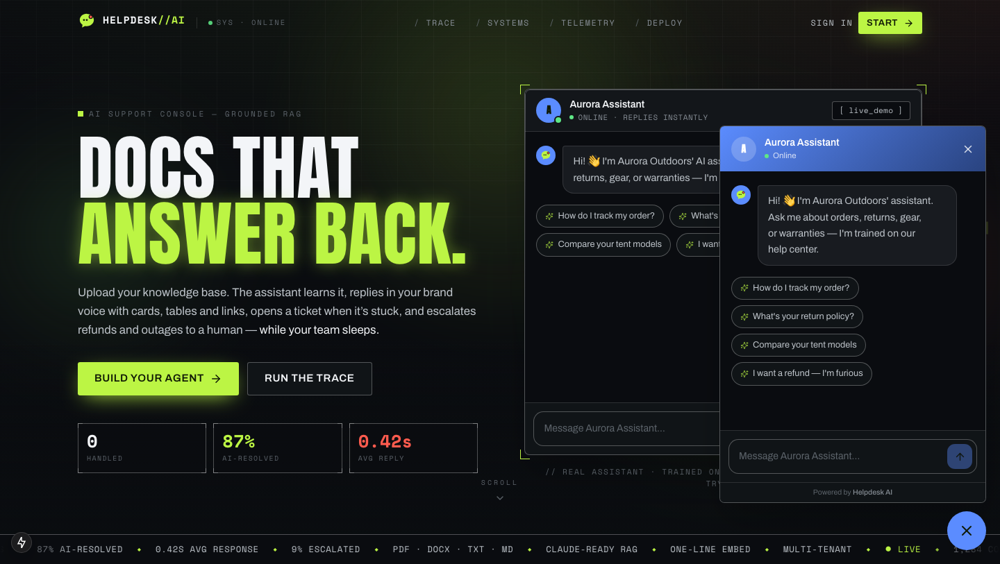<br/><sub><b>Widget</b> — the real embeddable assistant, live on any site</sub></td>
  </tr>
</table>

---

## Quick start

> Prerequisites: **Node 18+** (tested on Node 22). No Docker, no Postgres, no keys.

```bash
# 1. Install
npm install

# 2. Create the SQLite database + seed the demo tenant
npm run setup          # prisma generate + db push + seed

# 3. Run
npm run dev            # → http://localhost:3000
```

### 🔑 Demo credentials

| Role  | Email               | Password       |
| ----- | ------------------- | -------------- |
| Owner | `admin@aurora.demo` | `Password123!` |
| Agent | `agent@aurora.demo` | `Password123!` |

The seed creates a demo business — **Aurora Outdoors** — with five KB articles
(in [`sample-knowledge-base/`](./sample-knowledge-base)) and ~70 conversations,
tickets and analytics events, so every screen is populated on first run.

- **Public widget key:** `pk_demo_aurora_outdoors_public`
- **Live widget:** [`/widget?key=pk_demo_aurora_outdoors_public`](http://localhost:3000/widget?key=pk_demo_aurora_outdoors_public)

---

## 🤖 Enabling a real LLM (optional, free)

Copy `.env.example` → `.env`. Pick **one** generation provider:

```bash
# Recommended — free, fast, OpenAI-compatible Llama models
GROQ_API_KEY="gsk_..."                  # get one at console.groq.com/keys
GROQ_MODEL="llama-3.3-70b-versatile"    # or llama-3.1-8b-instant, gemma2-9b-it

# — or — Anthropic / Claude instead
ANTHROPIC_API_KEY="sk-ant-..."
ANTHROPIC_MODEL="claude-opus-4-8"

# Optional — semantic embeddings (otherwise a local offline embedder is used)
OPENAI_API_KEY="sk-..."
```

Provider precedence: **Groq → Anthropic → offline mock**. The active providers are
shown in **Settings → AI engine** and at `GET /api/health`. After switching
embedding providers, hit **Re-index all** on the Knowledge Base page
(`POST /api/documents/reindex`) to recompute vectors.

> **Why no embeddings on Groq?** Groq doesn't expose an embeddings endpoint, so
> retrieval stays on the deterministic local embedder — which works fully offline.
> Add OpenAI only if you want semantic-quality embeddings.

---

## 🧠 How the AI works — the TRACE

The landing page renders this as a scroll-scrubbed **TRACE**: watch one real
question (*"I was charged twice. I want a refund NOW."*) travel the whole machine.

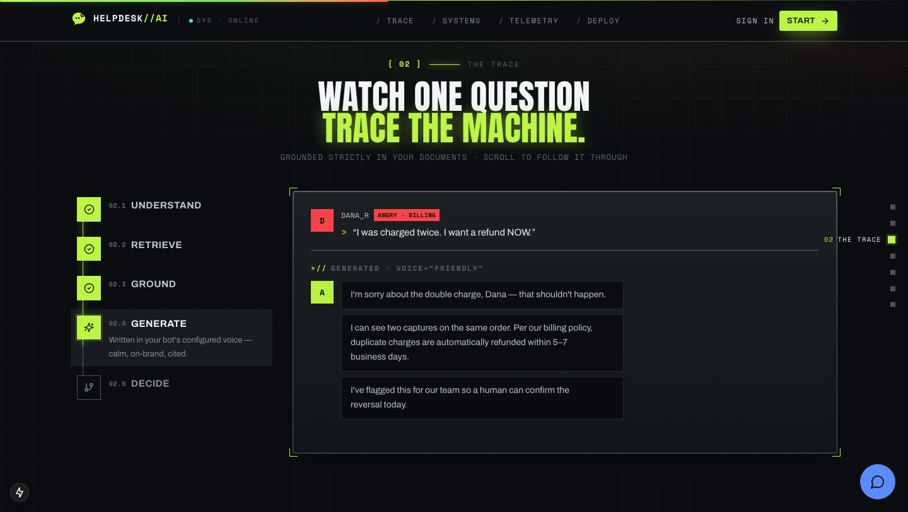

```
UNDERSTAND → RETRIEVE → GROUND → GENERATE → DECIDE
```

| Stage | What happens |
| ----- | ------------ |
| **Understand** | Read intent + sentiment, embed the message into your docs' vector space |
| **Retrieve**   | Cosine search pulls the top-k closest chunks, ranked by similarity |
| **Ground**     | Only the *real* retrieved sources become context — nothing is invented |
| **Generate**   | Answer written in the bot's configured voice, with cards/links, citing sources |
| **Decide**     | Resolve, suggest a follow-up, or escalate to a human + open a priority ticket |

<details>
<summary><b>Full request sequence (mermaid)</b></summary>

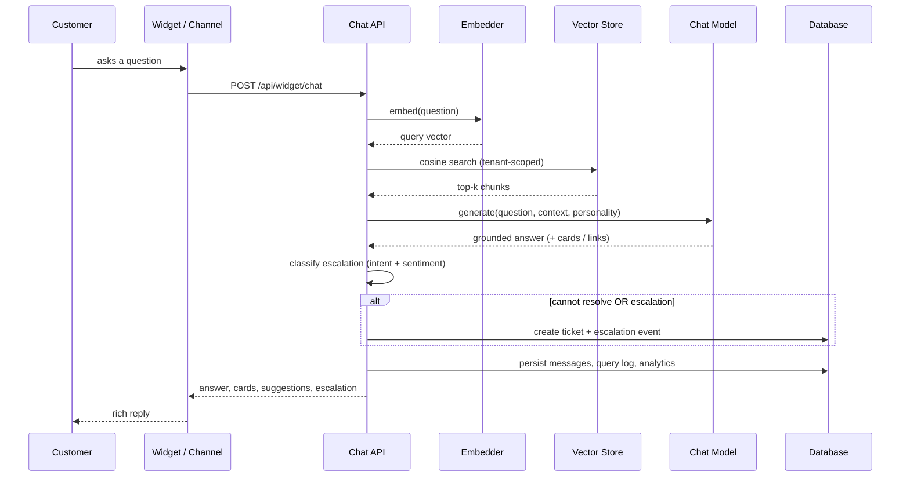

</details>

**Ingestion:** `parse → chunk (paragraph-aware, overlapping) → embed → store vectors`.
Retrieval and generation sit behind the `Embedder`, `VectorStore`, and `ChatModel`
interfaces in [`src/lib/ai`](./src/lib/ai) — so Groq, Claude, OpenAI, pgvector or
Qdrant swap in without touching the application. Full diagram, data model and
scaling path in [`docs/ARCHITECTURE.md`](./docs/ARCHITECTURE.md).

---

## 🧱 Tech stack

| Layer        | Choice                                                                 |
| ------------ | ---------------------------------------------------------------------- |
| Frontend     | Next.js 15 (App Router) · React 19 · TypeScript · Tailwind CSS v4      |
| Motion / UI  | Framer Motion (scroll-reactive storytelling) · hand-built SVG charts · Lucide |
| Backend      | Next.js Route Handlers (REST) · layered service architecture          |
| Auth         | JWT (`jose`) in httpOnly cookies · bcrypt · RBAC (Owner / Agent)       |
| Database     | Prisma ORM · SQLite (dev) / PostgreSQL (prod) — provider-portable      |
| Vector store | Application-layer cosine similarity (pgvector / Qdrant adapter doc)    |
| Generation   | **Groq** (free, Llama) or **Claude** when keyed · grounded offline mock otherwise |
| Embeddings   | OpenAI `text-embedding-3-small` when keyed · local hashed embedder     |

---

## 🗂️ Project structure

```
src/
  app/
    (admin)/        Authenticated portal: dashboard, knowledge-base,
                    configuration, conversations, tickets, escalations,
                    analytics, settings  (route group with an auth guard)
    api/            REST route handlers (auth, documents, config, chat,
                    tickets, conversations, analytics, widget, integrations)
    login | register | forgot-password | reset-password
    widget/         Full-page widget (iframe target of /widget.js)
    page.tsx        Scroll-reactive marketing landing + live chat demo
  components/
    landing/        Hero, problem, story (TRACE), features, showcase, embed, HUD
    admin/          App shell (sidebar, command palette), page primitives
    chat/           Reusable ChatPanel, markdown + rich-content renderers
    widget/         Floating embeddable chat widget
    ui/             Buttons, inputs, badges, toasts, charts
  lib/
    ai/             embedder, vectorstore, chatmodel, rag, ingest, escalation
    services/       chat (single chat-turn engine), metrics
    auth.ts, env.ts, db.ts, validation.ts, constants.ts ...
prisma/
  schema.prisma     Multi-tenant data model
  seed.ts           Demo tenant + sample KB + realistic data
public/
  widget.js         Embeddable loader script
  widget-demo.html  Example of the widget embedded on a third-party site
sample-knowledge-base/   Five Markdown KB articles
```

---

## 🔌 Embed the widget on any site

One line before `</body>`:

```html
<script
  src="https://YOUR_APP_URL/widget.js"
  data-key="pk_demo_aurora_outdoors_public"
  defer
></script>
```

The loader injects an **isolated iframe** (host CSS can't leak in), sized to the
launcher when closed and expanded when open. It loads its own branding, suggested
questions and personality from the tenant key. See a working example in
[`public/widget-demo.html`](./public/widget-demo.html), or copy the snippet from
**Settings → Embed your widget**.

---

## 🧪 REST API (selected)

| Method     | Route                              | Purpose                         |
| ---------- | ---------------------------------- | ------------------------------- |
| POST       | `/api/auth/register \| login`      | Create tenant / sign in         |
| GET        | `/api/dashboard`                   | Headline metrics                |
| GET        | `/api/analytics`                   | Chat + knowledge-base analytics |
| POST       | `/api/documents` (multipart)       | Upload + ingest documents       |
| POST       | `/api/documents/[id]/reindex`      | Re-embed a document             |
| GET / PUT  | `/api/config`                      | Read / update bot configuration |
| POST       | `/api/chat`                        | Authenticated "test your bot"   |
| POST       | `/api/widget/chat`                 | Public widget chat (publicKey)  |
| GET / PATCH| `/api/tickets[/:id]`               | List / update tickets           |
| GET        | `/api/conversations[/:id]`         | Transcripts + events            |
| POST       | `/api/conversations/[id]/handoff`  | Human handoff                   |
| POST       | `/api/integrations/whatsapp`       | Inbound WhatsApp → AI           |
| POST       | `/api/integrations/email`          | Inbound email → ticket          |
| GET        | `/api/health`                      | Status + active AI providers    |

All authenticated routes enforce session + tenant scoping; mutating config / team /
reindex routes are **Owner-only** (RBAC).

---

## ☁️ Deployment

Standard Next.js server — **no Docker required**.

### Option A — Render (native Node, SQLite demo)

A `render.yaml` blueprint is included. On Render: **New → Blueprint → point at this
repo**. It provisions a native Node web service:

- **Build:** `npm ci && npm run build`
- **Start:** `sh scripts/start.sh` — applies the schema, seeds the demo on first
  boot, then runs `next start` (binds Render's `$PORT`).

Set `NEXT_PUBLIC_APP_URL` after the first deploy, and add `GROQ_API_KEY` to enable
real generation. The free filesystem is ephemeral, so the SQLite DB re-seeds a
fresh demo on each cold start — for durable data use Option B.

### Option B — Postgres (Vercel / Render / any host)

1. In `prisma/schema.prisma` set `provider = "postgresql"`.
2. Set `DATABASE_URL` (Postgres connection string) and `AUTH_SECRET`.
3. Build: `prisma generate && prisma db push && next build`.
4. Seed once: `npm run db:seed`.

The data model is provider-portable (no SQLite-only types); vector search lives in
the application layer, so it works on either database unchanged.


---

## 📦 Scripts

```bash
npm run dev        # dev server
npm run build      # production build (prisma generate + next build)
npm run setup      # generate client + push schema + seed
npm run db:seed    # seed demo data
npm run db:reset   # wipe + re-seed
npm run db:studio  # Prisma Studio
```

---

<div align="center">
<sub>Built for the Magentic AI assessment · Retrieval-augmented support, end to end.</sub>
</div>
