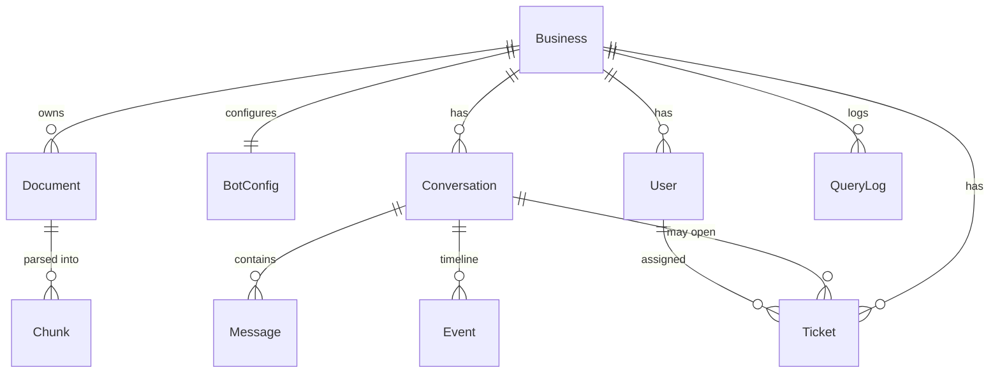

# Architecture

Helpdesk AI is a single Next.js 15 application with a clearly layered backend.
Route handlers are thin; all logic lives in typed services and an isolated AI
layer. Multi-tenancy and RBAC are enforced at the service boundary.

## System overview

```mermaid
graph TD
    subgraph Clients
      LP[Marketing site<br/>live chat demo]
      WID[Embeddable widget<br/>widget.js → iframe]
      ADM[Admin portal<br/>dashboard / KB / tickets / analytics]
      WA[WhatsApp webhook]
      EM[Email webhook]
    end

    subgraph "Next.js app (App Router)"
      direction TB
      RH[REST Route Handlers<br/>auth · RBAC · tenant scope]
      subgraph Services
        CHAT[chat engine<br/>handleChatTurn]
        METRICS[metrics service]
      end
      subgraph "AI layer (interfaces)"
        ING[ingest: parse → chunk → embed]
        EMB[Embedder<br/>local | OpenAI]
        VS[VectorStore<br/>cosine search]
        CM[ChatModel<br/>mock | Claude]
        RAG[RAG orchestrator]
        ESC[escalation classifier]
      end
    end

    DB[(Database<br/>Prisma · SQLite/Postgres)]

    LP & WID & WA & EM --> RH
    ADM --> RH
    RH --> CHAT --> RAG
    RH --> METRICS --> DB
    RH --> ING --> EMB --> DB
    RAG --> EMB --> VS --> DB
    RAG --> CM
    CHAT --> ESC
    CHAT --> DB
```

## Request layers

```
HTTP → Route Handler → (requireAuth / requireRole + tenant scope)
     → Service (chat engine, metrics, ingest)
     → AI layer (Embedder / VectorStore / ChatModel) and/or Prisma
     → JSON envelope { ok, data | error }
```

- **Route handlers** ([`src/app/api`](../src/app/api)) parse + validate input
  (Zod), authenticate, and delegate. They never contain business logic.
- **Services** ([`src/lib/services`](../src/lib/services)) own the work.
  `handleChatTurn` is the single chat-turn engine used by the widget, admin
  preview, WhatsApp and email — one code path, four entry points.
- **AI layer** ([`src/lib/ai`](../src/lib/ai)) is provider-agnostic. Swapping
  Claude for another model, or the in-process vector store for pgvector, touches
  one file and no callers.

## The AI interfaces (why it scales)

```ts
interface Embedder   { embed(text): number[]; embedBatch(texts): number[][] }
interface VectorStore{ search(tenantId, queryVec, k): RetrievedChunk[] }
interface ChatModel  { generate(params): { answer, cards?, links?, canAnswer } }
```

| Interface     | Offline default            | Keyed upgrade                  | Production swap            |
| ------------- | -------------------------- | ------------------------------ | -------------------------- |
| `Embedder`    | local feature-hash vectors | OpenAI `text-embedding-3-small`| Voyage / Cohere            |
| `VectorStore` | cosine over DB chunks      | (same)                         | pgvector / Qdrant / Pinecone |
| `ChatModel`   | grounded mock              | Claude (Anthropic)             | any LLM                    |

The factory functions (`getEmbedder`, `getChatModel`) select the implementation
from environment at runtime — no build flags, no code branches in callers.

## Data model



Every tenant-owned row carries `businessId`; all queries are scoped by it, which
is the multi-tenant isolation boundary. `Chunk.embedding` stores the vector as a
JSON string (provider-agnostic), and retrieval similarity is computed in the
application layer — see [`vectorstore.ts`](../src/lib/ai/vectorstore.ts).

## Escalation

`classifyEscalation` combines built-in intent rules (refund, payment failure,
service outage, legal, human-requested), tenant-defined keywords, and sentiment
detection. The highest-priority match wins and sets the ticket priority
(URGENT / HIGH / MEDIUM / LOW). When the AI cannot ground an answer, the turn is
routed to a human as a MEDIUM ticket. See
[`escalation.ts`](../src/lib/ai/escalation.ts).

## Scaling the vector store (production)

The in-app cosine store is O(n) per query and ideal for the assessment's data
volume. To scale, implement the same `search()` signature against pgvector:

```sql
CREATE EXTENSION vector;
ALTER TABLE "Chunk" ADD COLUMN embedding_vec vector(1536);
CREATE INDEX ON "Chunk" USING hnsw (embedding_vec vector_cosine_ops);
-- search:
SELECT id, content FROM "Chunk"
WHERE "businessId" = $1
ORDER BY embedding_vec <=> $2::vector LIMIT $3;
```

Because the RAG orchestrator depends only on the interface, this is a drop-in
replacement with no changes to chat, ingest, or the API.

## Security

- Passwords hashed with bcrypt; sessions are signed JWTs in httpOnly,
  SameSite=Lax cookies.
- RBAC: Owner vs Agent; configuration, team management, and global re-index are
  Owner-only.
- Tenant scoping on every data access prevents cross-business leakage.
- The widget uses a **public, non-secret** key that only grants scoped chat +
  ticket creation, never admin data.
```
